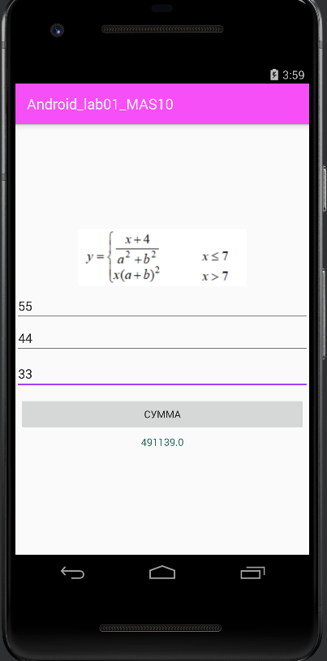
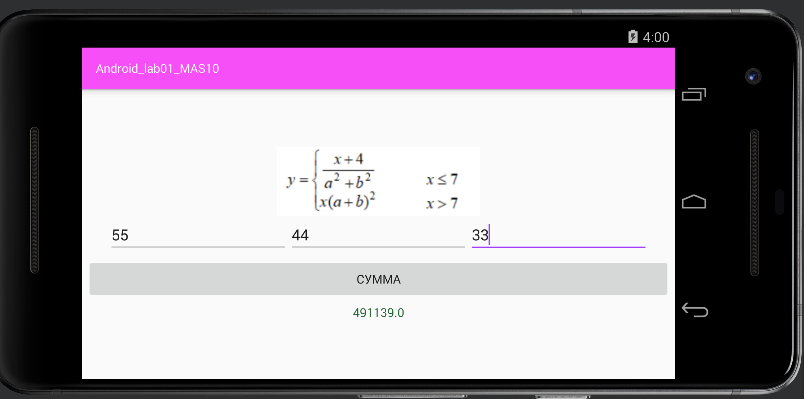

# Android_lab01_MAS10

___

___

if (x <= 7) {
                c = (x+4) / (Math.pow(a, 2) + (Math.pow(b, 2)));
            }
            else {
                c = (x) * (Math.pow(a, 2) + (Math.pow(b, 2)));
            }